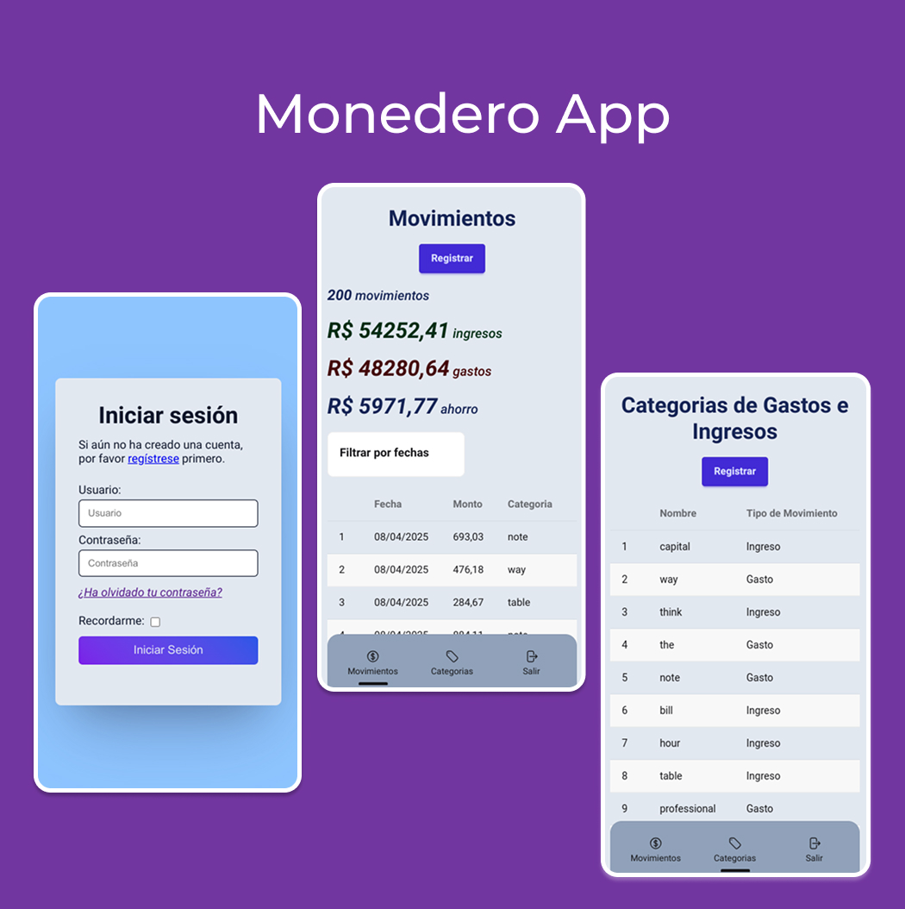

# Monedero

This is a Django + HTMX web app to keep track of my personal balance.



## Table of Contents

- [Introduction](#monedero)
- [Requirements](#️requirements)
- [Technologies Used](#technologies-used)
- [Quick Start (Linux/macOS)](#quick-start-linuxmacos)
  - [Python Setup](#python-setup)
    - [Creating a Virtual Environment (optional)](#creating-a-virtual-environment-optional)
    - [Copying the .env.example File](#copying-the-envexample-file)
    - [Installing Python Dependencies](#installing-python-dependencies)
    - [Running Migrations](#running-migrations)
    - [Running the Seeder](#running-the-seeder)
    - [Starting the Django Development Server](#starting-the-django-development-server)
  - [Node / Vite Setup](#node--vite-setup)
- [How Does It Work](#how-does-it-work)
  - [Mixins](#mixins)
  - [Implementations](#implementations)


## ️Requirements

- Python 3.10.12  
- pip 22.0.2  
- Node.js v22.14.0

## Technologies Used

This project integrates several modern tools and libraries to enhance the development experience and improve performance:

- [Django](https://docs.djangoproject.com/en/stable/) – A high-level Python Web framework that encourages rapid development and clean, pragmatic design.
- [django-vite](https://django-vite.dev/) – Integrates the Vite build tool with Django for blazing-fast front-end development.
- [Vite.js](https://vitejs.dev/) – Next-generation front-end tooling that focuses on speed and performance.
- [django-cotton](https://github.com/basedpy/django-cotton) – Provides template componentization to write reusable and composable HTML blocks in Django.
- [django-htmx](https://pypi.org/project/django-htmx/) – Seamless integration of HTMX with Django.
- [HTMX](https://htmx.org/docs/) – A library that allows you to access modern browser features directly from HTML, simplifying interactivity without needing a full JavaScript frontend.
- [Tailwind CSS](https://tailwindcss.com/docs) – A utility-first CSS framework for rapidly building custom user interfaces.
- [DaisyUI](https://daisyui.com/docs/) – A Tailwind CSS component library that makes it easy to create beautiful UI elements out-of-the-box.
- [django-allauth](https://django-allauth.readthedocs.io) – Integrated Django applications that handle authentication, registration, account management, and third-party (social) account authentication.

## Quick Start (Linux/macOS)

### Python Setup

#### Creating a virtual environment *(optional)*

```shell
python -m venv venv
source venv/bin/activate
```

#### Copying the .env.example file
```shell
cp .env.example .env
```

#### Installing Python dependencies
```shell
pip install -r requirements.txt
```

#### Running migrations
```python
python manage.py migrate
```

#### Running the seeder
```python
python manage.py runscript basic_seeder
```

> [!NOTE] The basic_seeder command will create a superuser with:
> - username: admin
> - password: 1234
> - email: admin@example.com


#### Starting the Django development server
```python
python manage.py runserver
```

### Node / Vite Setup
open a new terminal, go to **vendor** folder, install dependencies, and start the development server

```shell
cd vendor
npm run install
npm run dev
```

You can now access the app at <a href="http://127.0.0.1:8000">http://127.0.0.1:8000<a> and log in using the superuser created by the [basic_seeder script](#running-seeder)
 

## How does it work

### Mixins
The most interesting pieces of logic live in  **wallet/views/mixing.py**.
Check out the following classes: 

- **HtmxFormMixing** : Defines behavior for handling HTMX form processing.

- **HtmxListFormView**: Manages creating and listing behavior. combines *HtmxFormMixing* with Django's *ListView*. Overrides *get_template_names* and adds a *post* method.

- **HtmxEditUpdateDeleteView**: Handles editing, updating, and deleting. Extends:
    - django.views.generic.View
    - django.views.generic.base.TemplateResponseMixin 
    - django.views.generic.detail.SingleObjectMixin
    - HtmxFormMixing 

### Implementations

You can find the implementations in other files inside wallet/views/. Below are two examples

```python
# wallet/views/view_categorias.py
from django import forms
from django.urls import reverse_lazy
from .mixins import (
    RequireSuperUser,
    HtmxListFormView,
    HtmxEditUpdateDeleteView
)
from wallet.models import (
    CategoriaMovimiento
)

class CategoriaMovimientoForm(forms.ModelForm):
    class Meta: 
        model = CategoriaMovimiento
        fields = "__all__"

class CategoriaMovimientoView(RequireSuperUser, HtmxListFormView):
    template_name = "wallet/categoria_movimiento/index.html"
    template_partial_name = "cotton/ui/categoria_movimiento/partial_table.html"
    template_form_partial_name = "cotton/ui/form.html"
    paginate_by = 20
    queryset = CategoriaMovimiento.objects.all()
    form_class = CategoriaMovimientoForm
    context_object_name = "categorias"
    retry_url = reverse_lazy("categoria_listar_registrar")
    success_url = reverse_lazy("categoria_listar_registrar")
    
    def get_context_data(self, **kwargs):
        context = super().get_context_data(**kwargs)
        context.update({
            "modal_detail_id":"movimiento_detail",
            "modal_detail_container_id":"movimiento_detail_modal_container",
        })
        return context
``` 

This class hanldes creation, form error re-rendering, listing, and pagination for the **CategoriaMovimiento** model

```python
# wallet/views/view_movimientos.py
from django import forms
from django.urls import reverse_lazy
from .mixins import (
    RequireSuperUser,
    HtmxEditUpdateDeleteView
)
from wallet.widgets import CustomDateTimeWidget
from wallet.models import (
    Movimiento
)

class MovimientoForm(forms.ModelForm):
    class Meta: 
        model = Movimiento
        exclude = ["registrado_por"]
        widgets = {
            'fecha': CustomDateTimeWidget(),
        }

class MovimientosEditDeleteView(RequireSuperUser, HtmxEditUpdateDeleteView):
    template_name = "cotton/ui/form.html"
    form_class = MovimientoForm
    success_url = reverse_lazy("movimiento_listar_registrar")
    queryset = Movimiento.objects.all()

    def save(self, form):
        movimiento = form.save()
        movimiento.registrado_por = self.request.user
        movimiento.save()
        return movimiento
    
    def get_retry_url(self):
        return reverse_lazy("movimiento_editar_eliminar", args=[self.kwargs['pk']])

```

This class handles rendering, form error display, updating, and deleting for instances of the **Movimiento** model.

